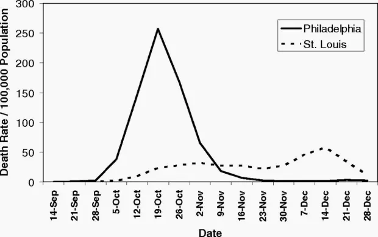

### Lessons from the 1918 Spanish flu pandemic 
The world of 2020 is vastly different from 1918, the year Spanish flu began to spread around the world. By 1920, Spanish flu is thought to have claimed the lives of up to 100 million people. But, as science writer and journalist Laura Spinney notes, many of the public health measures were similar to measures governments are taking today.   

[Spanish flu](https://audio.guim.co.uk/2020/03/30-67185-200331TIFspanishflu.mp3)   

<audio>
  <source src="https://audio.guim.co.uk/2020/03/30-67185-200331TIFspanishflu.mp3" type="audio/mp3">
  <p>Your browser does not support the video element.</p>
</audio>
    
### This chart of the 1918 Spanish flu shows why social distancing works
In 1918, the city of Philadelphia threw a parade that killed thousands of people. Ignoring warnings of influenza among soldiers preparing for World War I, the march to support the war effort drew 200,000 people who crammed together to watch the procession. Three days later, every bed in Philadelphia’s 31 hospitals was filled with sick and dying patients, infected by the Spanish flu.
By the end of the week, more than 4,500 were dead in an outbreak that would claim as many as 100 million people worldwide. By the time Philadelphia’s politicians closed down the city, it was too late.   
   
Proceedings of the National Academy of Sciences   

A different story played out in St. Louis, just 900 miles away. Within two days of detecting its first cases among civilians, the city closed schools, playgrounds, libraries, courtrooms, and even churches. Work shifts were staggered and streetcar ridership was strictly limited. Public gatherings of more than 20 people were banned.
The extreme measures—now known as social distancing, which is being called for by [global health agencies](https://www.cdc.gov/coronavirus/2019-ncov/php/risk-assessment.html) to mitigate the spread of the novel coronavirus—kept per capita flu-related deaths in St. Louis to [less than half](https://www.nytimes.com/2007/04/17/health/17flu.html) of those in Philadelphia, according to [a 2007 paper in the Proceedings of the National Academy of Sciences](https://www.pnas.org/content/104/18/7582).

### What The 1918 Flu Pandemic Teaches Us About The Coronavirus Outbreak

   
<div align="center">
<iframe width="100%" height="124" scrolling="no" frameborder="no" src="https://player.wbur.org/onpoint/2020/03/24/lessons-coronavirus-1918-flu-pandemic"></iframe>
</div>
...   
[John Barry](http://www.johnmbarry.com/), professor at the Tulane University School of Public Health and Tropical Medicine. Author of "[The Great Influenza: The Story of the Deadliest Pandemic in History.](https://www.amazon.com/Great-Influenza-Deadliest-Pandemic-History/dp/0143036491)" [(@johnmbarry)](https://twitter.com/johnmbarry?lang=en)   
[Jack Beatty](https://www.wbur.org/inside/staff/jack-beatty), On Point news analyst. [(@JackBeattyNPR)](https://twitter.com/JackBeattyNPR)   

### The COVID-19 curve   
Reducing the basic reproduction number by drastically reducing contacts or quickly isolating infectious diseases also reduces the size of the outbreak.
Using a simple model to illustrate this point. 

### The SIR model   
The **[SIR model](https://en.wikipedia.org/wiki/Compartmental_models_in_epidemiology)** is one of the simplest compartmental models, and many models are derivatives of this basic form. 
The model consists of three compartments: **S** for the number of susceptible, **I** for the number of infectious, and **R** for the number of recovered or deceased (or immune) individuals. 
Each member of the population typically progresses from susceptible to infectious to recovered. This can be shown as a flow diagram in which the boxes represent the different compartments and the arrows the transition between compartments, i.e. 
   


To model the dynamics of the outbreak we need three differential equations, one for the change in each group, where $\beta$ is the parameter that controls the transition between *S* and *I* and $\gamma$ which controls the transition between  and :   

$$
\begin{eqnarray*}
\frac{dS(t)}{dt} &=& -\beta S(t) I(t), \\
\frac{dI(t)}{dt} &=& \beta S(t) I(t) - \gamma I(t), \\
\frac{dR(t)}{dt} &=& \gamma I(t).
\end{eqnarray*}
$$

```{r, message=FALSE, warning=FALSE, echo=FALSE}
# clean current workspace
rm(list=ls(all=T))
###
library(conflicted)
library(dplyr)
conflict_prefer("filter", "dplyr")
###

library(deSolve)
#library(platus)
library(tidyverse)
library(lubridate)
#setwd("D:/Downloads/work_python_and_R/_R_/COVID-19")
source("functions.R",  echo=FALSE)
#source("read_in_all_dfs.R",  echo=FALSE)
```

```{r, message=FALSE, warning=FALSE}
#
x <- util_scrape_table("https://github.com/CSSEGISandData/COVID-19/blob/master/csse_covid_19_data/csse_covid_19_time_series/time_series_covid19_confirmed_global.csv")

deaths <- util_scrape_table("https://github.com/CSSEGISandData/COVID-19/blob/master/csse_covid_19_data/csse_covid_19_time_series/time_series_covid19_deaths_global.csv")
recovered <- util_scrape_table("https://github.com/CSSEGISandData/COVID-19/blob/master/csse_covid_19_data/csse_covid_19_time_series/time_series_covid19_recovered_global.csv")

y <- x %>% row_to_names(1) %>% clean_names %>% remove_empty() %>%
  gather(date, infections, -1:-4) %>%
  mutate(date = str_remove_all(date, "x")) %>%
  mutate(date = mdy(date)) %>%
  mutate(infections = parse_number(infections))

dy <- deaths %>% row_to_names(1) %>% clean_names %>% remove_empty() %>%
  gather(date, infections, -1:-4) %>%
  mutate(date = str_remove_all(date, "x")) %>%
  mutate(date = mdy(date)) %>%
  mutate(infections = parse_number(infections))

ry <- recovered %>% row_to_names(1) %>% clean_names %>% remove_empty() %>%
  gather(date, infections, -1:-4) %>%
  mutate(date = str_remove_all(date, "x")) %>%
  mutate(date = mdy(date)) %>%
  mutate(infections = parse_number(infections))

#dy

#time_series_covid19_all <- rbind(y, dy, ry)
#time_series_covid19_all

from_date <-  dmy("02/03/2020")
sir_start_date <- "2020-03-02"

#y$country_region
#filter(y, country_region == "Portugal")
#filter(dy, country_region == "Portugal")
#filter(ry, country_region == "Portugal")


pt    <- y %>% filter(country_region == "Portugal") %>%
  filter(date >= from_date) %>%
  group_by(date, province_state) %>% summarise(infections_pt = sum(infections)) #%>%
  #filter(province_state == "New South Wales")
# group_by(date) %>% summarise(infections_pt = sum(infections))

#pt

Infected <- pt$infections_pt
Infected
Day <- 1:(length(Infected))
N <- 10276617 # população de Portugal do INE

#setwd("D:/Downloads/work_python_and_R/_My_Blogs_/mpmendespt.github.io/_drafts")

```

Putting this into R code: 

```{r, message=F, warning=F}

SIR <- function(time, state, parameters) {
  par <- as.list(c(state, parameters))
  with(par, {
    dS <- -beta/N * I * S
    dI <- beta/N * I * S - gamma * I
    dR <- gamma * I
    list(c(dS, dI, dR))
  })
}
```

To fit the model to the data we need two things: a solver for differential equations and an optimizer. To solve differential equations the function ode from the deSolve package (on CRAN) is an excellent choice, to optimize we will use the optim function from base R. Concretely, we will minimize the sum of the squared differences between the number of infected *I* at time *t* and the corresponding number of predicted cases by our model *Î(t)*: 

$RSS(\beta, \gamma )=\sum_{t}(I(t) - Î(t)^2$

Putting it all together:
```{r, message=F, warning=F}

library(deSolve)
init <- c(S = N-Infected[1], I = Infected[1], R = 0)
RSS <- function(parameters) {
  names(parameters) <- c("beta", "gamma")
  out <- ode(y = init, times = Day, func = SIR, parms = parameters)
  fit <- out[ , 3]
  sum((Infected - fit)^2)
}
 
Opt <- optim(c(0.5, 0.5), RSS, 
             method = "L-BFGS-B", 
             lower = c(0, 0), 
             upper = c(1, 1),
             control = list(parscale = c(10^-4,10^-4))) # optimize with some sensible conditions
Opt$message
## [1] "CONVERGENCE: REL_REDUCTION_OF_F <= FACTR*EPSMCH"
 
Opt_par <- setNames(Opt$par, c("beta", "gamma"))
Opt_par
##      beta     gamma
## 1.0000000 0.7523632

t <- 1:80 # time in days
fit <- data.frame(ode(y = init, times = t, func = SIR, parms = Opt_par))
col <- 1:4 # colour

old <- par(mfrow = c(1, 2))
# Plot Margins
par(mar = c(1, 2, 3, 1.1)) # Set the margin on all sides to 2
# par(mar = c(bottom, left, top, right))

matplot(fit$time, fit[ , 2:4], type = "l", xlab = "Day", ylab = "Number of subjects", lwd = 2, lty = 1, col = col)
matplot(fit$time, fit[ , 2:4], type = "l", xlab = "Day", ylab = "Number of subjects", lwd = 2, lty = 1, col = col, log = "y")
## Warning in xy.coords(x, y, xlabel, ylabel, log = log): 1 y value <= 0
## omitted from logarithmic plot
 
points(Day, Infected,  col = "blue")
#legend("bottomright", c("Susceptibles", "Infecteds", "Recovereds"), lty = 1, lwd = 2, col = col, inset = 0.05)
legend("bottomleft", c("Susceptibles", "Forcast Infecteds", "Forecast Recovereds", "Infecteds"), cex=0.7, lty = 1, lwd = 3, col = col, inset = c(0.19, 0.01), box.col="green")

title("SIR model COVID-19 Portugal", outer = TRUE, line = -2)

```

We can now extract some interesting statistics. One important number is the so-called basic reproduction number (also basic reproduction ratio) $R_0$ (pronounced “R naught”) which basically shows how many healthy people get infected by a sick person on average:
$R_0 = \frac{\beta}{\gamma}$

```{r, message=F, warning=F}
par(old)
 
R0 <- setNames(Opt_par["beta"] / Opt_par["gamma"], "R0")
R0
##       R0 
## 1.329145
 
height_pand <- fit[fit$I == max(fit$I), "I", drop = FALSE] # height of pandemic
height_pand
##           I
## 56	344780.1

height_day <- as.integer(row.names(height_pand))

max_infected <- max(fit$I)
max_infected
## [1] 344799

max_infected / 5 # severe cases
## 1] 68959

max_infected_day <- from_date + height_day # height of pandemic
max_infected_day
## [1] "2020-04-27"
 
max_infected * 0.06 # cases with need for intensive care
## [1] 20687
 
max_deaths <- max(fit$I) * 0.02 # max deaths with supposed 2% fatality rate
max_deaths
## [1] 6895
```
**According to this model, the height of a possible pandemic would be reached by `r max_infected_day`  (`r height_day` days after it started). About `r format(max_infected, digits=6, nsmall=0, big.mark = " ")` people would be infected by then, which translates to about `r format(max_infected/5, digits=5, nsmall=0, big.mark = " ")` severe cases, about `r format(max_infected * 0.06, digits=5, nsmall=0, big.mark = " ")` cases in need of intensive care and up to `r format(max_deaths, digits=4, nsmall=0, big.mark = " ")` deaths.**      
Those are the numbers our model produces and nobody knows whether they are correct while everybody hopes they are not.   
Do not panic! All of this is hopefully (probably!) false. When you play along with the above model you will see that the fitted parameters are far from stable...


### References     
* [https://www.theguardian.com/news/audio/2020/mar/31/lessons-from-the-1918-spanish-flu-pandemic-podcast](https://www.theguardian.com/news/audio/2020/mar/31/lessons-from-the-1918-spanish-flu-pandemic-podcast)
* [https://qz.com/1816060/a-chart-of-the-1918-spanish-flu-shows-why-social-distancing-works/](https://qz.com/1816060/a-chart-of-the-1918-spanish-flu-shows-why-social-distancing-works/)
* [https://www.wbur.org/onpoint/2020/03/24/lessons-coronavirus-1918-flu-pandemic](https://www.wbur.org/onpoint/2020/03/24/lessons-coronavirus-1918-flu-pandemic)
* [https://blog.ephorie.de/epidemiology-how-contagious-is-novel-coronavirus-2019-ncov](https://blog.ephorie.de/epidemiology-how-contagious-is-novel-coronavirus-2019-ncov)
* [https://blog.ephorie.de/covid-19-the-case-of-germany](https://blog.ephorie.de/covid-19-the-case-of-germany)
* [https://github.com/JoeFernando/corona](https://github.com/JoeFernando/corona)   
* [https://stats.stackexchange.com/questions/446712/fitting-sir-model-with-2019-ncov-data-doesnt-conververge](https://stats.stackexchange.com/questions/446712/fitting-sir-model-with-2019-ncov-data-doesnt-conververge)   
* [https://github.com/CSSEGISandData/COVID-19](https://github.com/CSSEGISandData/COVID-19)   
* [https://staff.math.su.se/hoehle/blog/2020/03/16/flatteningthecurve.html](https://staff.math.su.se/hoehle/blog/2020/03/16/flatteningthecurve.html)   
* [https://rpubs.com/choisy/sir](https://rpubs.com/choisy/sir)   


  


